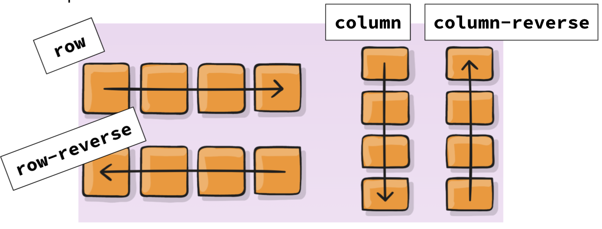
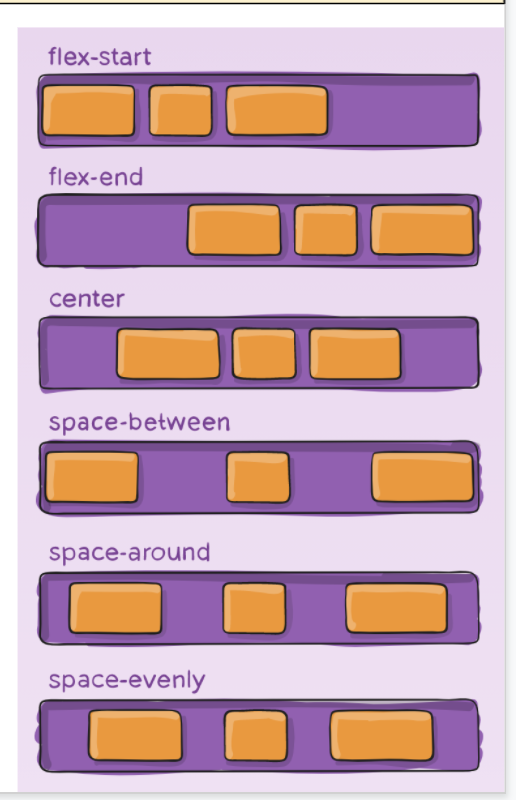
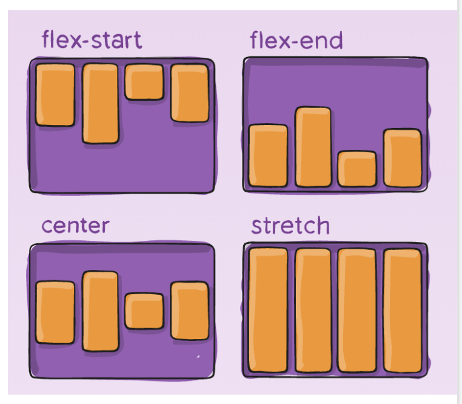

# Flexbox Code Along

Today we will be learning how to style our pages using CSS Flexbox! Flexbox, like CSS Grid, allows us to structure content on the page using containers and CSS rulesets. 

A flexbox layout is made of parent elements which we can call containers or rows, and child elements nested inside them, which we could call items or columns.


## Task
When styling a flexbox, we have proeprties of the parent and properties of the child that require rulesets. **Try out each of the parent and child properties on the `style.css` file**.

To setup a flexbox, ensure the container has the following display ruleset

```css
/* The parent container must have display of flex for flexboxes to work! */
.row {
	display: flex;
}
```

Properties of the Parent
------------------------
1. `flex-direction`: A property of the parent. Establishes the main axis which is the direction items are placed in the flex container. Can have the values of:
	- `row`
	- `row-reverse`
	- `column`
	- `column-reverse`



2. `justify-content`: This defines arrangement of items and how extra free space leftover will be distributed.
justify-content can have the values: 
- `flex-start`
- `flex-end`
- `center`
- `space-around`
- `space-between`
- `space-evenly`



3. `align-items`: This defines the default behavior for how flex items are laid out along the cross axis on the current line. 
Think of it as the justify-content version for the cross-axis (perpendicular to the main-axis). Can have the values of:
- `flex-start`
- `flex-end`
- `center`
- `stretch`



Properties of the Child
------------------------
1. `flex`: Sets how child elements distribute remaining free space. Typical values are:
	- `flex: 0;` Child elements will not expand or contract. Default behavior.
	- `flex: 1;` Child elements will expand or contract to take up exactly all the available space in the parent element, sizing themselves equally to all their siblings.
	`flex: auto;` Child elements will expand or contract to take up exactly all the available space in the parent element, sizing themselves proportionally to their content (elements with more text will take up more space).
